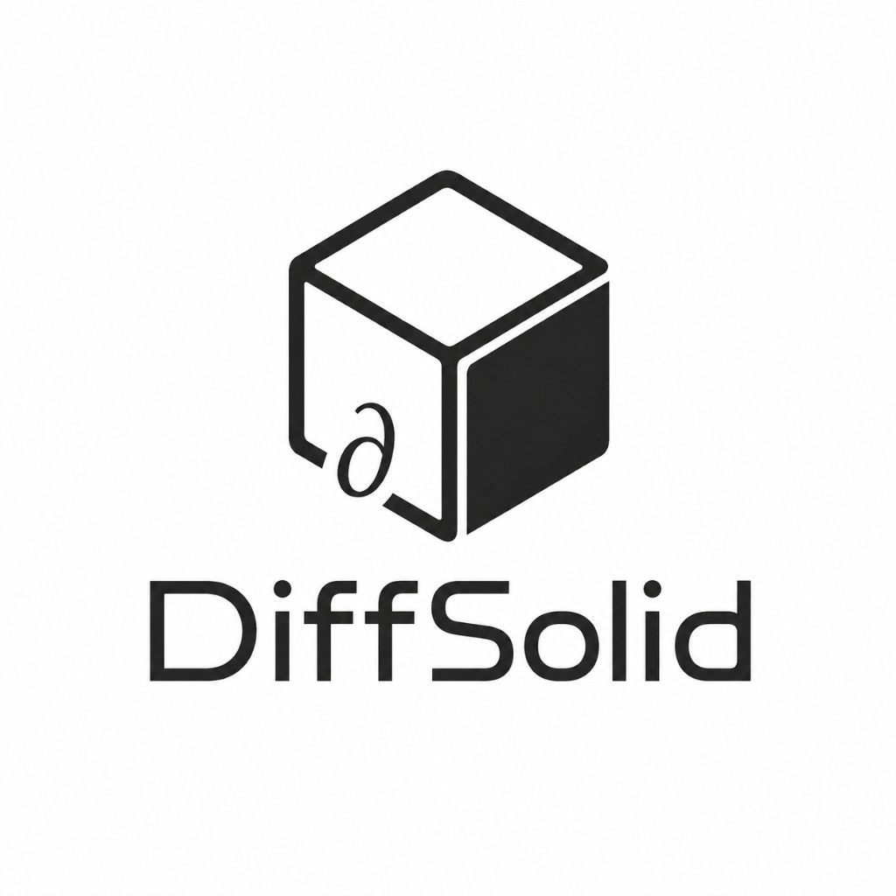

# DiffSolid

**DiffSolid is a JAX-native differentiable finite-element framework for
nonlinear solid mechanics, phase-field fracture, GPU computing, and
gradient-based inverse design.**

<p align="center">
  <a href="https://zclsjtu.github.io/DiffSolid/">
    
  </a>
</p>

<p align="center">
  <a href="https://zclsjtu.github.io/DiffSolid/"></a>
  <a href="https://zclsjtu.github.io/DiffSolid/install/#request-preview-wheel"></a>
  <a href="https://www.python.org/"></a>
  
</p>

<p align="center">
  <a href="https://zclsjtu.github.io/DiffSolid/install/#request-preview-wheel"><strong>Request preview wheel</strong></a>
  &nbsp;·&nbsp;
  <a href="https://zclsjtu.github.io/DiffSolid/quickstart/">Quick Start</a>
  &nbsp;·&nbsp;
  <a href="https://zclsjtu.github.io/DiffSolid/gallery/">Gallery</a>
  &nbsp;·&nbsp;
  <a href="https://zclsjtu.github.io/DiffSolid/api/">API</a>
</p>

---

Problems are set up in Python; assembly and solvers run on **JAX** with optional **GPU**
backends (AmgX, cuDSS, AMGCL). The stack supports quasi-static and explicit dynamics, staggered
multi-physics coupling, and gradient-based inverse problems.

```python
import diffsolid as ds

sim = ds.Simulation(name="demo", dim=3, ele_type="HEX8")
sim.load_mesh("mesh.msh")
sim.add_physics(ds.physics.SolidMechanics(material=mat))
result = sim.solve(output_dir="results/")
```

> **Note.** This repository publishes **documentation, examples, and benchmark figures** only.
> The solver wheel is **not on PyPI** — email to [request a preview wheel](https://zclsjtu.github.io/DiffSolid/install/#request-preview-wheel); we reply by email when appropriate.

---

## Capabilities

<table>
<tr>
<td width="50%" valign="top">

### Solid mechanics

- Small- and finite-strain kinematics; 3D, plane, axisymmetric
- Elements: standard, B-bar, **F-bar**, F-bar patch, **EAS**
- Implicit NR (line search, arc-length) and explicit dynamics
- Built-in elasticity, J₂ plasticity, crystal plasticity, hyperelasticity
- **Custom UMAT** via JAX — consistent tangents from AD

</td>
<td width="50%" valign="top">

### Phase-field fracture

- AT1/AT2 and cohesive degradation; spectral / hybrid splits
- Damage PDEs: elliptic, parabolic, pseudo-parabolic, inertial
- Validated staggered strategy matrix **S1–S7**
- VI-Newton damage solves; PBC-capable mechanics + phase field
- Irreversibility and regional active zones

</td>
</tr>
</table>

**Solvers & performance** — GPU sparse linear algebra (**NVIDIA AmgX** preferred; cuDSS, AMGCL CUDA);
explicit dynamics on H200-class hardware; implicit scaling benchmarked against **FEniCSx (64-core CPU)**.

---

## Documentation

| | |
|---|---|
| [Documentation site](https://zclsjtu.github.io/DiffSolid/) | Home, install, theory, API |
| [Quick Start](https://zclsjtu.github.io/DiffSolid/quickstart/) | Plasticity, explicit bar, S1/S3 fracture, custom UMAT |
| [Theory](https://zclsjtu.github.io/DiffSolid/theory/) | Quasi-static, dynamic, and phase-field formulations |
| [API reference](https://zclsjtu.github.io/DiffSolid/api/) | User-facing Python API |
| [Install](https://zclsjtu.github.io/DiffSolid/install/) | Email [ChenlongZhao@sjtu.edu.cn](mailto:ChenlongZhao@sjtu.edu.cn) to request a preview wheel |
| [Download wheel](https://zclsjtu.github.io/DiffSolid/download/) | How email distribution works (no public download) |

---

## Gallery

Curated benchmark figure sequences (visualisation only — no solver source):

- [Dynamic fracture](https://zclsjtu.github.io/DiffSolid/gallery/dynamic-fracture/) — Borden branching through Kalthoff GPU scaling
- [Quasi-static PF fracture](https://zclsjtu.github.io/DiffSolid/gallery/quasi-static-pf-fracture/) — L-panel and periodic unit cells
- [Volumetric locking](https://zclsjtu.github.io/DiffSolid/gallery/volumetric-locking/) — Cook membrane and axisymmetric necking
- [Solver efficiency](https://zclsjtu.github.io/DiffSolid/gallery/solver-efficiency/) — AmgX on H200 vs FEniCSx CPU scaling

→ [Full gallery index](https://zclsjtu.github.io/DiffSolid/gallery/)

---

## Examples

Scripts under [`examples/`](examples/) use the public `import diffsolid as ds` API (wheel required):

```bash
python examples/sm_finite_strain_plasticity.py
python examples/sm_explicit_dynamics.py
```

Place a mesh at `meshes/bar.msh` or edit paths in the scripts. Details: [`examples/README.md`](examples/README.md).

---

## Repository contents

| This repo | Distributed package |
|-----------|----------------------|
| Docs, examples, gallery assets | `import diffsolid as ds` |
| Theory & API reference | Numerical kernels & GPU extensions |
| Benchmark figures | Solver implementation (proprietary) |

Implementation is **not open source**. Use is subject to the [license](docs/legal/license.md).

---

## Citation

```bibtex
@software{zhao_diffsolid_2026,
  author  = {Zhao, Chenlong},
  title   = {DiffSolid: JAX-native differentiable finite elements
             for solid mechanics and phase-field fracture},
  version = {0.1.0},
  year    = {2026},
  url     = {https://github.com/zclsjtu/DiffSolid}
}
```

See [CITATION.cff](CITATION.cff).

---

<p align="center">
  <sub>Wheel access &amp; licensing — <a href="mailto:ChenlongZhao@sjtu.edu.cn">ChenlongZhao@sjtu.edu.cn</a></sub>
</p>
