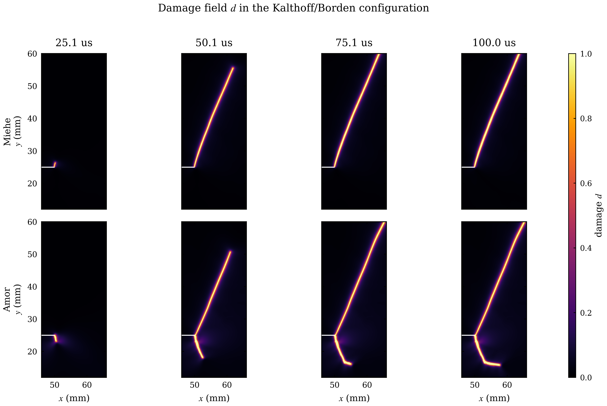
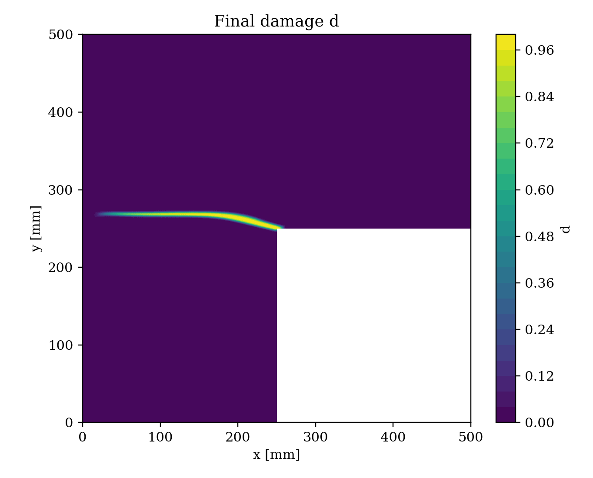
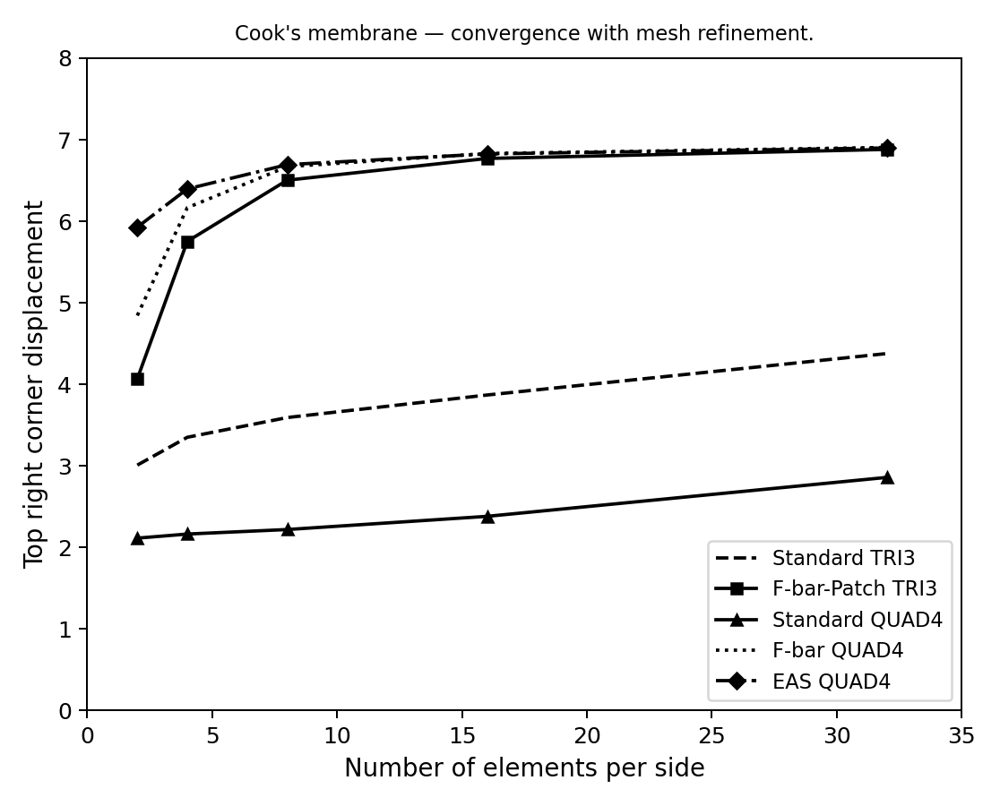
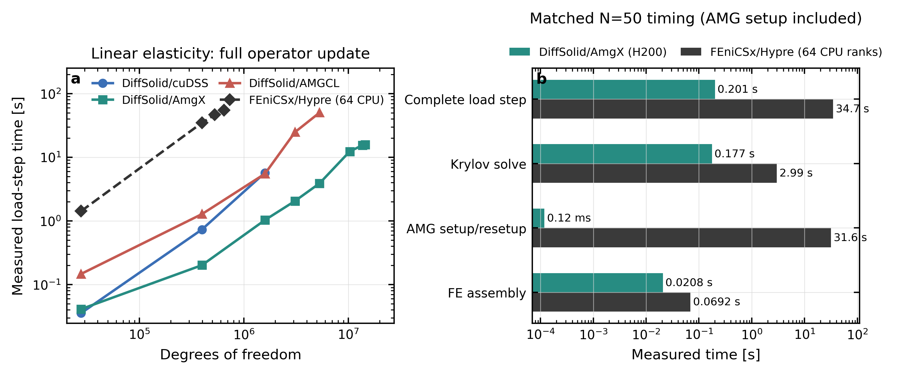

Curated benchmark figure sequences from validation and performance studies.
Click a case for the full story; click any panel inside for full resolution.

<a class="ds-gallery-card" href="dynamic-fracture/">
  
    
  
  
    Dynamic fracture
    Borden branching, Kalthoff morphology, S3 velocity, explicit GPU scaling.
  
</a>

<a class="ds-gallery-card" href="quasi-static-pf-fracture/">
  
    
  
  
    Quasi-static phase-field fracture
    L-panel cohesive fracture — Miehe vs hybrid split, VI-Newton; PBC unit cells.
  
</a>

<a class="ds-gallery-card" href="volumetric-locking/">
  
    
  
  
    Volumetric locking
    Cook's membrane convergence; axisymmetric necking with F-bar, F-bar-Patch, and EAS.
  
</a>

<a class="ds-gallery-card" href="solver-efficiency/">
  
    
  
  
    Solver efficiency
    DiffSolid AmgX on H200 vs FEniCSx CPU×64; explicit GPU throughput on Kalthoff benchmarks.
  
</a>

Figures are for <strong>visualisation and portfolio purposes</strong> only — no solver source or full result archives.
<a href="../quickstart.md">Quick Start</a> · <a href="../theory/index.md">Theory</a>

