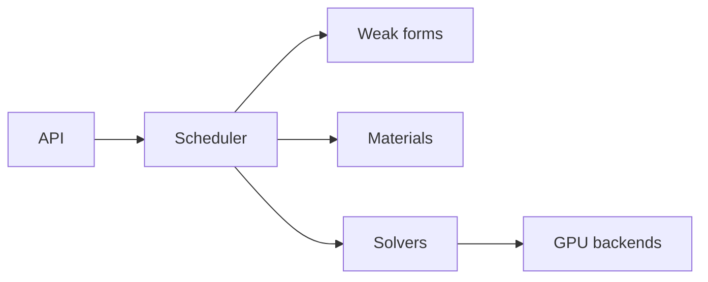

<section class="ds-home__hero">

Differentiable Solid Mechanics

<h1 class="ds-home__title">DiffSolid</h1>

JAX-native finite element framework for nonlinear mechanics, GPU sparse solvers,
and validated phase-field fracture workflows.

  <a href="quickstart/">Quick Start</a>
  <a href="install/">Install</a>
  <a href="api/">API</a>

<ul class="ds-home__tags">
  <li>JAX · AD</li>
  <li>FEM</li>
  <li>Phase-field S1–S7</li>
  <li>AMGCL · cuDSS</li>
</ul>

</section>

<a class="ds-tile" href="quickstart/">
  Examples
  Quick Start
  S1 quasi-static and S3 explicit dynamics.
</a>

<a class="ds-tile" href="api/">
  Reference
  API
  Simulation, steps, materials, solvers.
</a>

<a class="ds-tile" href="install/">
  Setup
  Installation
  Wheel, JAX GPU, AMGCL, cuDSS.
</a>

<a class="ds-tile" href="theory/formulations/">
  Theory
  Formulations
  FE weak forms, constitutive models, solvers.
</a>

!!! info "Documentation only"
    Public docs and examples. Solver binaries ship via GitHub Releases under a proprietary license.

## Architecture

## Phase-field strategies (S1–S7)

| ID | Mechanics | Damage PDE | Integrator | Coupling |
|----|-----------|------------|------------|----------|
| S1 | quasi_static | elliptic | implicit | stagger |
| S2 | explicit CD | elliptic | implicit | one_pass |
| S3 | explicit CD | parabolic | explicit | one_pass |
| S4 | explicit CD | inertial | verlet | one_pass |
| S5 | quasi_static | parabolic | implicit | stagger |
| S6 | quasi_static | pseudo_par | implicit | stagger |
| S7 | explicit CD | pseudo_par | explicit | one_pass |

Details: [API §4](api/index.md#4-phase-field-fracture-strategies-s1s7).
