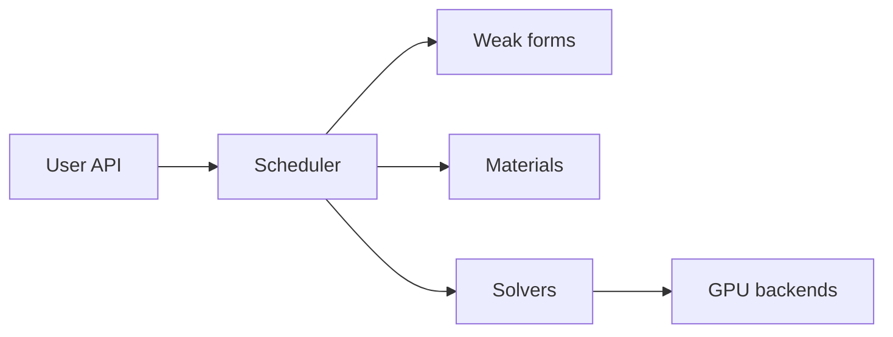

<section class="ds-home__hero">

Simulation Platform

<h1 class="ds-home__title">DiffSolid</h1>

A JAX-native finite element environment for building, running, and differentiating
nonlinear solid mechanics simulations on CPU and GPU.

  <a href="quickstart/">Quick Start</a>
  <a href="install/">Install</a>
  <a href="api/">API</a>

<ul class="ds-home__tags">
  <li>Nonlinear FEM</li>
  <li>Automatic differentiation</li>
  <li>GPU solvers</li>
  <li>Multi-physics workflows</li>
</ul>

</section>

<a class="ds-tile" href="quickstart/">
  Examples
  Quick Start
  Minimal scripts to set up and run a simulation.
</a>

<a class="ds-tile" href="api/">
  Reference
  API
  Simulation setup, materials, solvers, and output.
</a>

<a class="ds-tile" href="install/">
  Setup
  Installation
  Package install and optional GPU backends.
</a>

<a class="ds-tile" href="theory/formulations/">
  Theory
  Formulations
  Finite element and constitutive theory reference.
</a>

!!! info "Documentation only"
    Public docs and examples. Solver binaries ship via GitHub Releases under a proprietary license.

## What you can do

- **Build FE models** — load meshes, assign elements, boundary conditions, and loading steps through a unified Python API.
- **Run nonlinear mechanics** — quasi-static and dynamic analysis with a library of constitutive models and element formulations.
- **Couple multiple physics** — staggered and monolithic multi-field workflows from a single simulation manager.
- **Scale on GPU** — optional sparse linear algebra backends for large 3D problems.
- **Differentiate and calibrate** — JAX-native assembly supports gradient-based inverse problems and parameter identification.
- **Post-process and export** — VTK output, checkpoints, and built-in post-processing hooks.

## Architecture

Specific problem setups and advanced physics options are documented in the [API reference](api/index.md) and [theory](theory/formulations.md) sections.
