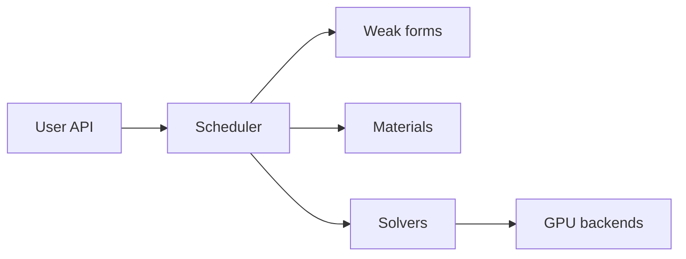

<section class="ds-home__hero">

Simulation platform

<h1 class="ds-home__title">DiffSolid</h1>

Nonlinear solid mechanics and phase-field fracture on a JAX-native finite
element stack — Python setup, CPU/GPU execution, end-to-end differentiation.

  <a class="ds-home__actions-primary" href="quickstart/">Quick Start</a>
  <a href="install/">Install</a>
  <a href="api/">API</a>

Solid mechanics · Phase-field fracture · GPU solvers · JAX AD

</section>

<a class="ds-tile" href="quickstart/">
  Examples
  Quick Start
  Minimal scripts to set up and run a simulation.
</a>

<a class="ds-tile" href="api/">
  Reference
  API
  Simulation setup, materials, solvers, and output.
</a>

<a class="ds-tile" href="install/">
  Setup
  Installation
  Package install and optional GPU backends.
</a>

<a class="ds-tile" href="theory/formulations/">
  Theory
  Formulations
  Finite element and constitutive theory reference.
</a>

<section class="ds-capabilities" markdown="1">

<h2 class="ds-capabilities__heading">What you can do</h2>

<h3 class="ds-cap-block__title">Solid mechanics</h3>

Nonlinear FE analysis for 3D, plane strain/stress, and axisymmetric models —
quasi-static or explicit dynamic — with built-in constitutive models.

<ul class="ds-cap-block__list">
  <li><strong>Formulations</strong> — small-strain and finite-strain kinematics; standard, B-bar, F-bar, F-bar patch, and EAS elements</li>
  <li><strong>Analysis modes</strong> — implicit quasi-static equilibrium; explicit central-difference dynamics; Newton–Raphson with line search and arc-length continuation</li>
  <li><strong>Built-in materials</strong> — linear and Neo-Hookean elasticity; J2 and finite-strain plasticity; viscoelasticity; FCC/BCC/HCP crystal plasticity; Mooney–Rivlin and Ogden hyperelastic potentials</li>
  <li><strong>Model setup</strong> — multi-material mesh sections, body forces, step-scoped Dirichlet/Neumann BCs, thickness for 2D models</li>
  <li><strong>Large-scale solves</strong> — GPU sparse backends (AMGCL, CUDSS) for 3D plasticity and nonlinear systems</li>
</ul>

<h3 class="ds-cap-block__title">Phase field</h3>

Phase-field fracture coupled to solid mechanics — diffuse crack representation,
degradation of elastic energy, and selectable damage evolution laws.

<ul class="ds-cap-block__list">
  <li><strong>Fracture models</strong> — AT1/AT2 phase-field; cohesive-zone degradation; spectral, volumetric–deviatoric, and hybrid strain splits</li>
  <li><strong>Coupling</strong> — staggered fixed-point (quasi-static) or one-pass (dynamic) mechanics–damage coupling; monolithic coupling is not supported</li>
  <li><strong>Damage PDEs</strong> — elliptic (Allen–Cahn type); parabolic viscous; pseudo-parabolic; inertial damage dynamics</li>
  <li><strong>Strategy presets (S1–S7)</strong> — e.g. quasi-static staggered fracture (S1), explicit dynamic fracture with viscous damage (S3); validated combinations enforced at solve time</li>
  <li><strong>Irreversibility &amp; solvers</strong> — variational inequality active-set Newton for damage; dedicated phase-field linear solvers</li>
  <li><strong>Regional control</strong> — per-section degradation laws and active zones to limit where damage can evolve</li>
</ul>

<a href="quickstart/#example-1-quasi-static-staggered-fracture-strategy-s1">Phase-field quick start →</a>

<h3 class="ds-cap-block__title">Custom UMAT</h3>

Plug in your own constitutive law by subclassing <code>UserMaterial</code> (stress-based)
or <code>UserPotential</code> (hyperelastic energy). The framework assembles the weak form
and builds consistent tangents with JAX automatic differentiation — no hand-derived
Jacobians.

<ul class="ds-cap-block__list ds-cap-block__list--cols">
  <li><strong>Interface</strong> — declare <code>kinematics</code> (<code>"strain"</code> or <code>"deformation_gradient"</code>) and optional Gauss-point <code>state_fields</code></li>
  <li><strong><code>umat(ε_or_F, state, dt)</code></strong> — return stress and updated history; use <code>jnp.*</code> / <code>jax.lax.*</code> only</li>
  <li><strong>Drop-in usage</strong> — pass your instance to <code>SolidMechanics(material=...)</code> like any built-in model</li>
  <li><strong>Inverse problems</strong> — material parameters remain differentiable through the full nonlinear solve</li>
</ul>

<a href="quickstart/#example-3-custom-umat-user-defined-material">Custom UMAT example →</a>

</section>

!!! info "Documentation only"
    Public docs and examples. Install the Python package by [requesting wheel access](install/#request-access) — wheels are not publicly linked.

## Platform

- **Unified simulation API** — meshes, physics, steps, couplers, and output from one `Simulation` manager.
- **Staggered multi-physics** — mechanics and phase-field fields are coupled via fixed-point or one-pass staggered schemes (not monolithic).
- **Differentiate and calibrate** — JAX-native assembly supports gradient-based inverse problems and parameter identification.
- **Post-process and export** — VTK output, checkpoints, diagnostics, and built-in post-processing hooks.

## Architecture

Specific problem setups and advanced physics options are documented in the [API reference](api/index.md) and [theory](theory/formulations.md) sections.
