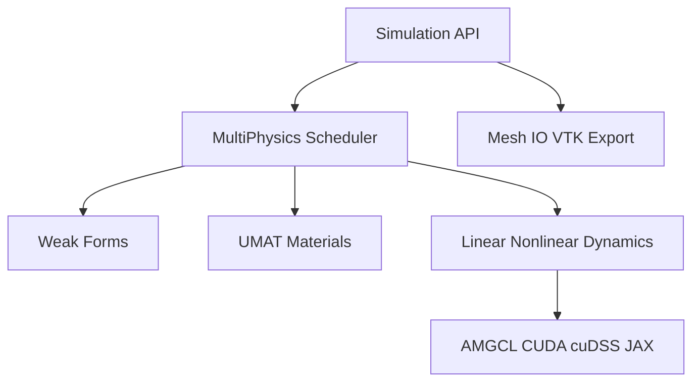

Computational Solid Mechanics · Phase-Field Fracture

<h1 class="ds-hero__title">DiffSolid</h1>

JAX-native differentiable finite element framework for nonlinear solid mechanics,
GPU-accelerated sparse solvers, and validated phase-field fracture strategies (S1–S7).

<ul class="ds-hero__tags">
  <li>JAX / AD</li>
  <li>FEM</li>
  <li>Phase-field</li>
  <li>GPU (AMGCL · cuDSS)</li>
</ul>

!!! note "Documentation scope"
    This site covers installation, API, and theory. The solver implementation is
    distributed as a proprietary package via GitHub Releases.

-   :material-rocket-launch:{ .lg .middle } **Quick Start**

    ---

    Minimal S1 and S3 phase-field fracture examples.

    [:octicons-arrow-right-24: Quick Start](quickstart.md)

-   :material-book-open-variant:{ .lg .middle } **API Reference**

    ---

    Simulation manager, steps, materials, solvers, and outputs.

    [:octicons-arrow-right-24: API](api/index.md)

-   :material-download:{ .lg .middle } **Installation**

    ---

    Wheel install, JAX GPU, AMGCL CUDA, and cuDSS.

    [:octicons-arrow-right-24: Install](install.md)

-   :material-image-multiple:{ .lg .middle } **Gallery**

    ---

    Benchmark figures — content coming soon.

    [:octicons-arrow-right-24: Gallery](https://github.com/zclsjtu/DiffSolid/tree/main/gallery)

---

## Architecture

---

## Phase-field fracture strategies

DiffSolid maps coupled mechanics–damage workflows to validated strategy IDs **S1–S7**:

| ID | Mechanics | Damage PDE | Damage integrator | Coupling |
|----|-----------|------------|-------------------|----------|
| S1 | quasi_static | elliptic | implicit | stagger_fixed_point |
| S2 | explicit_central_difference | elliptic | implicit | stagger_one_pass |
| S3 | explicit_central_difference | parabolic_viscous | explicit_euler | stagger_one_pass |
| S4 | explicit_central_difference | inertial | explicit_verlet | stagger_one_pass |
| S5 | quasi_static | parabolic_viscous | implicit | stagger_fixed_point |
| S6 | quasi_static | pseudo_parabolic | implicit | stagger_fixed_point |
| S7 | explicit_central_difference | pseudo_parabolic | explicit_euler_tau | stagger_one_pass |

See the [API reference](api/index.md#4-phase-field-fracture-strategies-s1s7) for configuration details.

---

## What is in this repository?

This public repository ships **documentation and examples only**. The numerical
implementation is distributed as a proprietary Python package via GitHub Releases.

For installation instructions, see [install.md](install.md).
